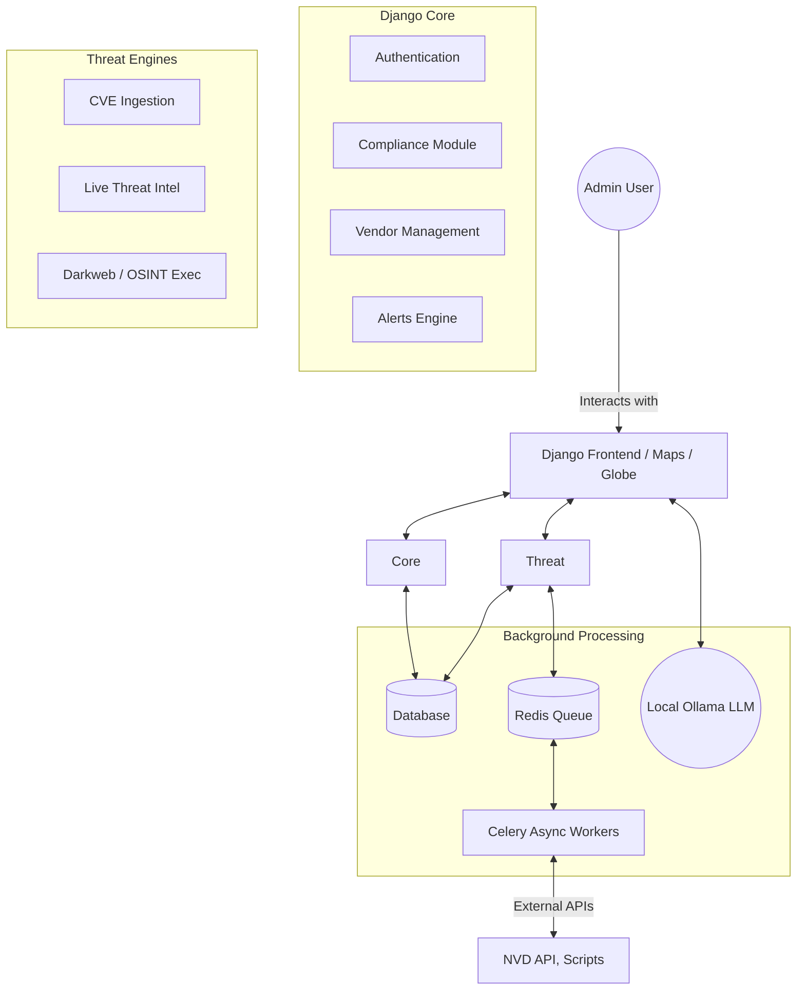
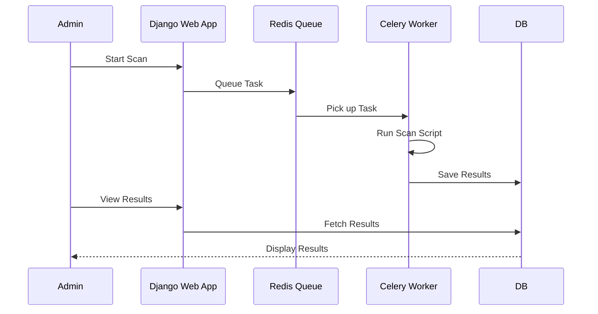
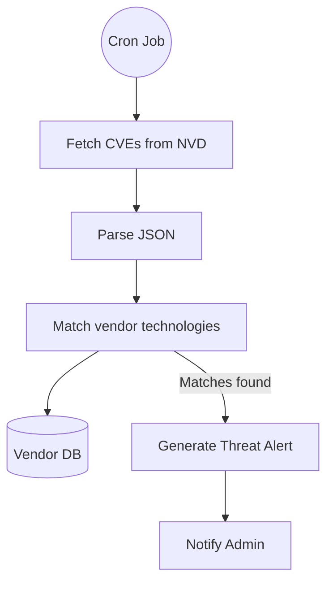
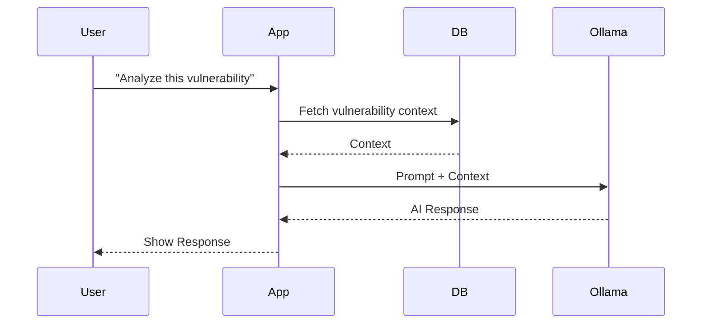

# Project Flowcharts

Here are all the necessary system flowcharts and architecture diagrams for the Threat Intelligence and Compliance Platform.

## 1. Complete System Architecture

## 2. Background Task Execution (OSINT / Scans)

## 3. CVE Alerting Flow

## 4. AI Chatbot Workflow

