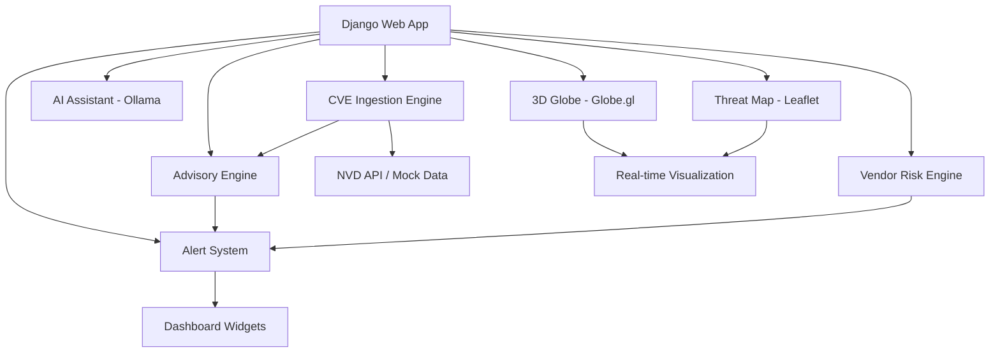

# AI-Powered Compliance & Threat Intelligence Platform - Implementation Plan

## Architecture Overview

## Phase 1: Django Project Setup
- Django project with apps: core, compliance, cve_engine, advisories, alerts, vendors, ai_assistant, threat_viz
- Database models for all entities
- Authentication system

## Phase 2: CVE Data Engine
- NVD API integration with fallback mock data
- Background task (management command + optional Celery)
- CVE → Advisory auto-generation
- CVE → Control mapping

## Phase 3: Compliance & Vendor Risk
- Framework models (ISO, GDPR, DPDP, SOC2, HIPAA, PCI DSS)
- Indian regulatory audits (RBI, NPCI, UIDAI, SEBI, IRDAI)
- Vendor risk scoring with CVE impact

## Phase 4: Visualization & UI
- Dashboard with widgets
- Leaflet threat map
- Globe.gl 3D visualization
- CVE feed, advisories, alerts pages

## Phase 5: AI Integration
- Ollama integration for CVE analysis
- Chat interface

## Tech Stack
- Backend: Django 5.x, Django REST Framework
- Frontend: HTML/CSS/JS, Chart.js, Leaflet, Globe.gl
- Background: Celery + Redis (with management command fallback)
- Database: SQLite (dev) / PostgreSQL (prod)
- AI: Ollama local
