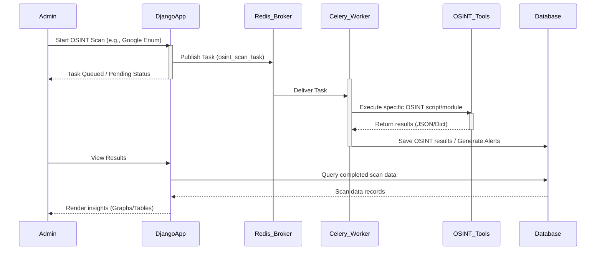
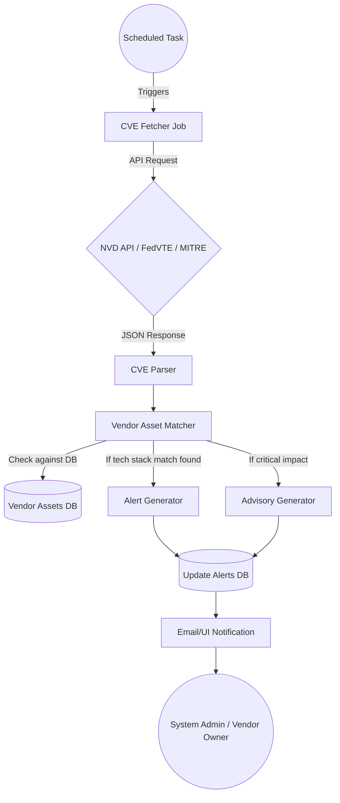
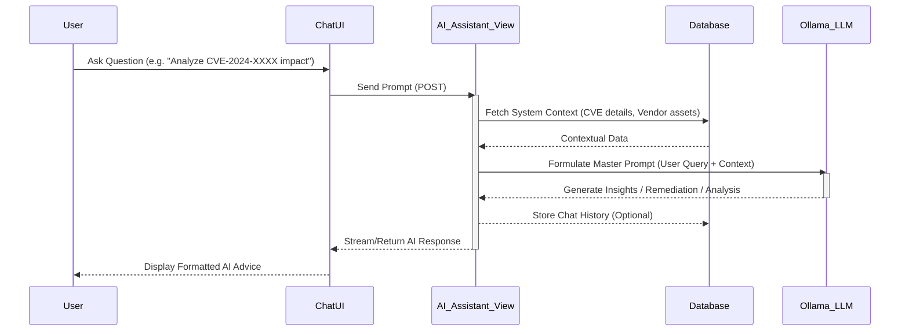
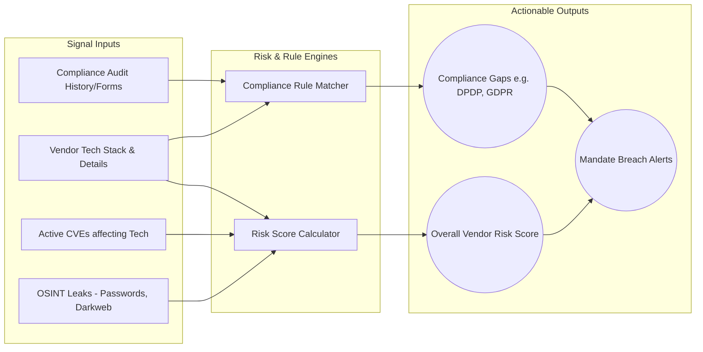

# System Architecture & Flowcharts
This document contains the detailed system architecture, component integrations, and data flows using Mermaid.js diagrams for the AI-Powered Compliance & Threat Intelligence Platform.

## 1. High-Level System Architecture
This depicts the overall macro-architecture including the front-end components, Django core, Threat Intel modules, Background Task Processors (Celery/Redis), and the local AI integration with Ollama.

```mermaid
graph TD
    User((User/Admin)) -->|HTTP/HTTPS| WebUI[Django Web Interface]
    
    subgraph Frontend
        WebUI
        Map[Leaflet 2D Map]
        Globe[Globe.gl 3D Viz]
        Charts[Chart.js / Dashboards]
    end
    
    subgraph Backend Core [Django Backend Core]
        CoreAuth[Core System & Auth]
        Compliance[Compliance Module]
        Vendors[Vendor Management]
        Alerts[Alerts Engine]
        Advisories[Advisory Engine]
    end
    
    subgraph Threat Intelligence
        CVE[CVE Engine]
        ThreatIntel[Live Threat Intel]
        DarkWeb[Darkweb / OSINT]
    end
    
    subgraph AI Processing
        AIAssistant[AI Assistant]
    end

    subgraph Infrastructure
        DB[(SQLite / PostgreSQL Database)]
        Redis[(Redis Cache / Broker)]
        Celery[Celery Task Workers]
        Ollama((Local Ollama LLM))
    end
    
    WebUI <--> Backend Core
    WebUI <--> Threat Intelligence
    WebUI <--> AI Processing
    
    Backend Core <--> DB
    Threat Intelligence <--> DB
    
    Threat Intelligence <--> Redis
    Redis <--> Celery
    Celery -->|Fetch Data Async| ExternalAPIs[NVD API, Google OSINT, etc.]
    
    AIAssistant <--> Ollama
    
    Map & Globe <--> ThreatIntel
```

## 2. Threat Intelligence & OSINT Execution Flow
This sequence details how an Admin triggers an OSINT scan (like Google Enumeration or Darkweb sweep) taking advantage of the async Celery/Redis architecture to prevent server blocking.



## 3. CVE Ingestion & Vulnerability Alerting Flow
Details the background process that fetches new Common Vulnerabilities and Exposures (CVEs) and maps them to currently logged vendor risk profiles.



## 4. AI Assistant (Ollama) Analysis Flow
Highlights how the AI Assistant leverages locally hosted LLMs through Ollama to analyze CVEs, provide remediation scripts, or chat contextually about threat landscapes.



## 5. Vendor Compliance & Risk Scoring Engine
How different signals (OSINT leaks, CVEs, Audit records) are combined to produce a unified vendor risk score and highlight compliance gaps.


